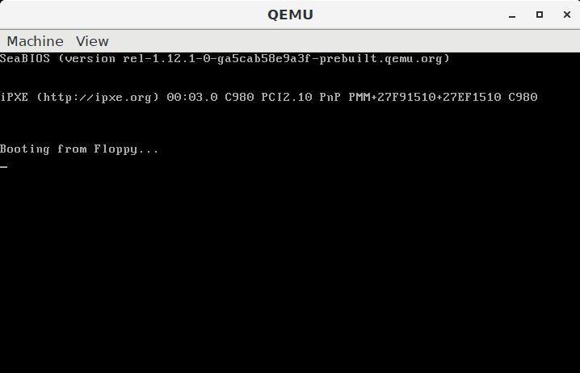

<a href="https://travis-ci.org/Tearth/MicrOS"></img></a>
<a href="https://github.com/Tearth/MicrOS/pulls?q=is%3Apr+is%3Aclosed"></img></a>
<a href="https://github.com/Tearth/MicrOS/blob/master/LICENSE"></img></a>
<a href="https://tearth.github.io/MicrOS/"></img></a>

This is the simple 32-bit operating system developed by the SKNI KOD (Studenckie Koło Naukowe Informatyków KOD). Our main goal is to create the OS which will have functionality similar to the famous MS-DOS and be able to run on every modern computer. Feel free to analyze and use any part of this project (but remember about GPL-3 license restrictions).

Full description of how to build MicrOS (on Linux or Windows 10 WSL) can be read here: https://github.com/jaenek/MicrOS-DevTools.

Documentation: https://tearth.github.io/MicrOS/

## What is done
* Bootloader which loads the kernel by looking for a file in a FAT12 filesystem and enters the protected mode
* A set of drivers for the devices
  * VGA - text and graphics mode
  * Keyboard
  * Floppy
  * PC Speaker
  * Serial port
  * RTC (Real-Time Clock)
  * PIT (Programmable Interval Timer)
  * ATA
* Interrupts (software, hardware, exceptions) manager
* Paging
* Physical/Virtual memory manager
* Heap
* FAT12/16 filesystem - read and write
* Partitions
* PCI (Peripheral Component Interconnect) - partially
* Panic screen
* Userspace
* ELF executing
* Multitasking (with a primitive round-rubin scheduler)
* Multiterminals
* Simple shell and basic applications
* Standard library for C
* ATA Hard disk drive support
* CPUID
* Multithreading

## TODO
* Other standards of hard disk drive support
* More advanced scheduler with priorities and IO blocking
* Support for network cards (and protocols related to them)
* Lock/mutex, synchronization objects, queues...
* ...

## Used tools
* Visual Studio Code - main IDE
* GCC - C compiler and linker
* NASM - asm compiler
* GDB - debugger
* ImDisk - managing floppy images
* dd - writing bootloader to the image

## Examples
#### Boot sequence

Screenshot of the boot sequence, taken during early development. Besides standard logs indicating the success of initialization OS components, there is also a test of reading file (/SYSTEM/TEST/LOREM.TXT) and heap dump to detect possible memory leaks.

#### Multitasking test

Test of the multitasking with five processes, where each one increments its internal counters and prints the value to the console. Each process manages to do these operations 4 times per time slice assigned by the OS before a switch to the next process.

#### Shell

A simple shell that allows executing other applications. Using Ctrl+F1/F2/F3/F4 user can switch to another terminal and run an application simultaneously with other ones.

#### Task manager

Task manager displaying basic info about the current operating system state. There are two bars (with processor utilization and memory usage) and a tree with all processes - initially, OS runs 4 terminals where each of it can run its child process (like TASKS or SNAKE here).

#### Example application (cat)

Example of working CAT application with KERNEL.BIN file given in the parameter. It displays the first 1600 bytes of the binary content (so that's why there are a ton of strange chars).

#### Example game (snake)

Example game made for MicrOS. It's a simple implementation of a snake game, with the list of best players saved in the separate file.

#### Gif

Animation presenting interaction with the MicrOS for basic operations like displaying time, list of files, changing the current directory, and executing a game.

